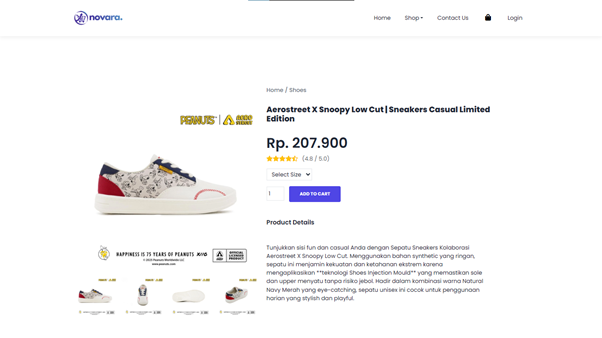
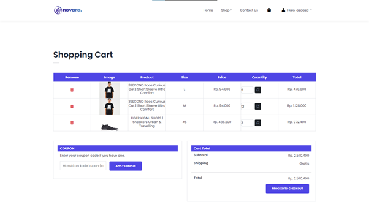
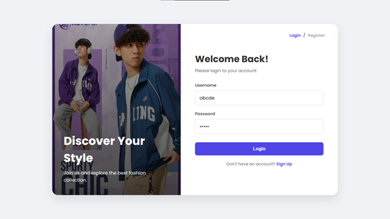

<div align="center">
  <a href="https://github.com/username_kamu/novara">
    
  </a>

  <h1 align="center">NOVARA - Streetwear E-Commerce</h1>

  <p align="center">
    <b>Platform E-Commerce Fashion Modern Berbasis Web (MVC)</b>
    <br />
    <a href="#-fitur-unggulan">Lihat Fitur</a>
    ·
    <a href="#-instalasi">Cara Install</a>
    ·
    <a href="#-screenshoot">Lihat Demo</a>
  </p>

  <p align="center">
    
    
    
    
  </p>
</div>

<br />

## 📖 Tentang Proyek

**Novara** adalah aplikasi *e-commerce* yang dirancang untuk mempermudah transaksi jual-beli produk *streetwear* (Hoodie, Sepatu, T-Shirt). Dibangun di atas framework **CodeIgniter 3**, aplikasi ini menerapkan arsitektur **MVC (Model-View-Controller)** yang rapi dan terstruktur.

Fokus utama pengembangan adalah pada **User Experience (UX)** dan **Integritas Data**, di mana sistem keranjang belanja (*Shopping Cart*) disimpan langsung ke dalam database untuk mencegah kehilangan data pesanan.

---

## 🚀 Fitur Unggulan

Berikut adalah fitur-fitur kunci yang telah diimplementasikan:

### 🛒 Sistem Belanja Cerdas
- [x] **Database-Driven Cart:** Keranjang belanja disimpan di database MySQL (Persistent), bukan sesi browser sementara.
- [x] **Smart Quantity Update:** User dapat mengubah jumlah barang langsung di halaman Cart dengan update harga otomatis.
- [x] **Kupon Diskon:** Fitur kode voucher (Contoh: `DISKON10`) yang memotong total harga secara *real-time*.
- [x] **Kalkulasi Otomatis:** Menghitung Subtotal, Diskon, dan Grand Total secara presisi.

### 🔐 Keamanan & Autentikasi
- [x] **Secure Login/Register:** Password dienkripsi menggunakan algoritma `password_hash` (Bcrypt).
- [x] **Session Protection:** Halaman transaksi (Cart/Checkout) terkunci untuk pengguna yang belum login (Redirect System).
- [x] **Validasi Input:** Mencegah input kosong atau format data yang salah.

### 🎨 Antarmuka (UI/UX)
- [x] **Responsive Design:** Tampilan optimal di Desktop, Tablet, dan Mobile menggunakan Bootstrap 5.
- [x] **Interactive Gallery:** Fitur ganti gambar utama produk saat thumbnail diklik (DOM Manipulation).
- [x] **Filter Kategori:** Navigasi cepat untuk memfilter produk berdasarkan jenis (Hoodie, Shoes, dll).

---

## 📸 Screenshots

Berikut adalah tampilan antarmuka aplikasi Novara:

| **Halaman Utama (Home)** | **Detail Produk** |
|:---:|:---:|
|  |  |
| *Banner Promosi & Produk Unggulan* | *Galeri Gambar & Pilihan Varian* |

| **Keranjang Belanja (Cart)** | **Halaman Login** |
|:---:|:---:|
|  |  |
| *Manajemen Item, Update Qty & Kupon* | *Desain Split-Screen Modern* |

---

## ⚙️ Instalasi & Penggunaan

Ikuti langkah-langkah berikut untuk menjalankan proyek ini di komputer lokal (Localhost):

### 1. Persiapan Lingkungan
Pastikan Anda sudah menginstall aplikasi berikut:
* **XAMPP** (atau WAMP/Laragon) dengan PHP versi 7.4 atau 8.0.
* **Git** (Opsional, untuk clone).
* **Web Browser** (Chrome/Edge/Firefox).

### 2. Clone Repository
Buka terminal atau CMD, arahkan ke folder `htdocs`, lalu jalankan:
```bash
git clone [https://github.com/khairudzakisyahdana-tech/Pemrograman-Visual](https://github.com/khairudzakisyahdana-tech/Pemrograman-Visual.git)
